## Задание 1

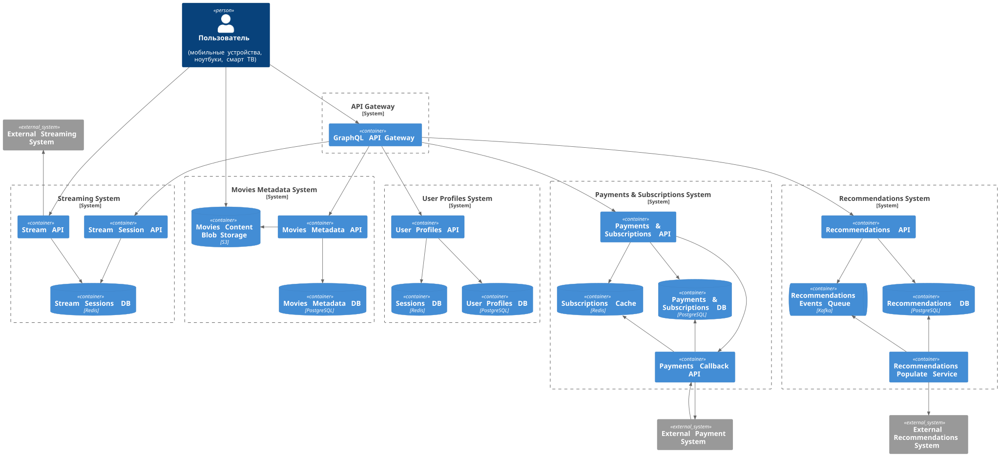

## Задание 2

Код:
- [src/microservices/proxy/](./src/microservices/proxy/)
- [src/microservices/events/](./src/microservices/events/)

Скриншоты:
- 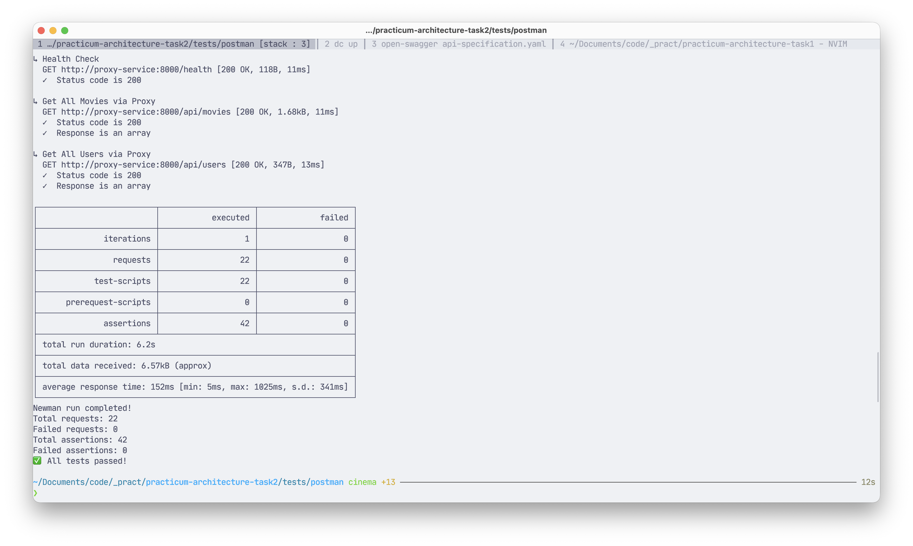
- 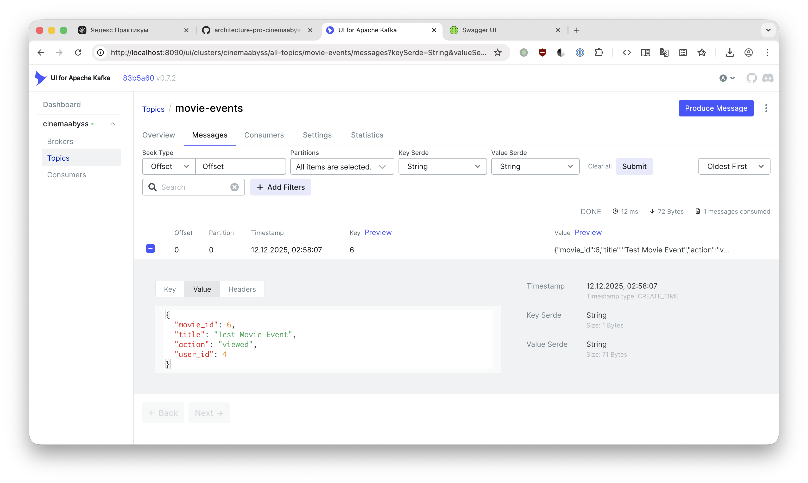
- 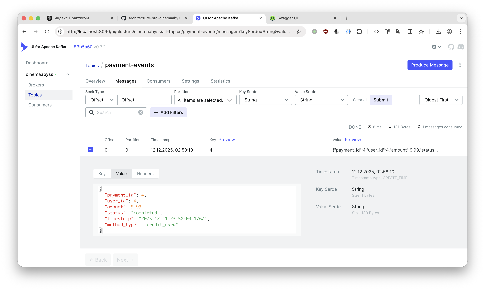
- 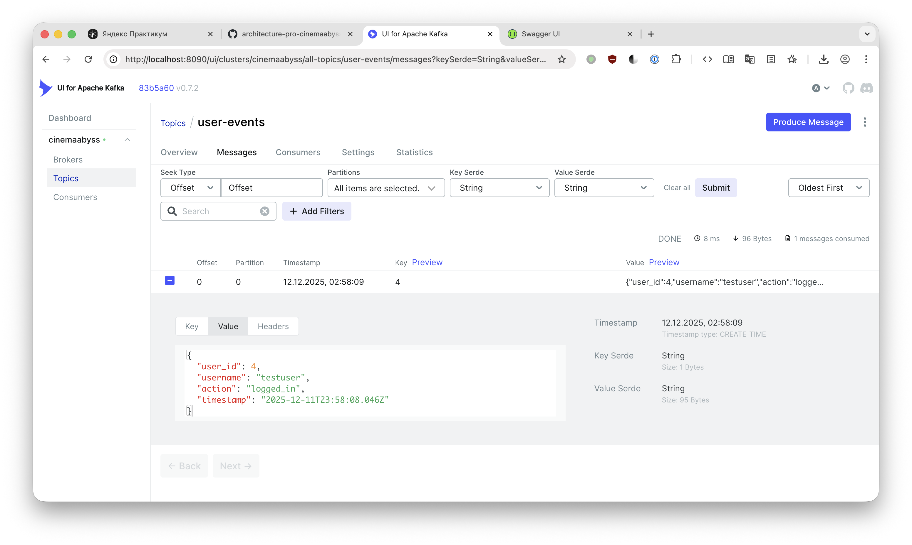

## Задание 3

Скриншоты:
- 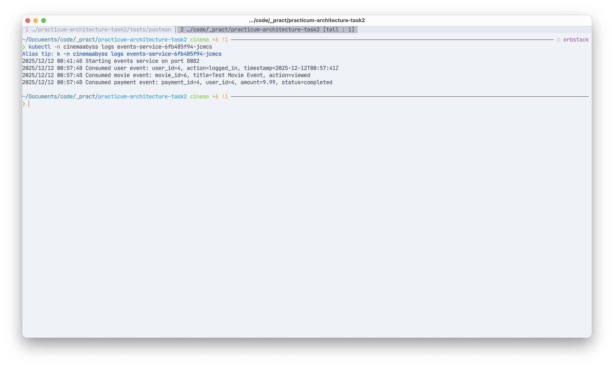
- 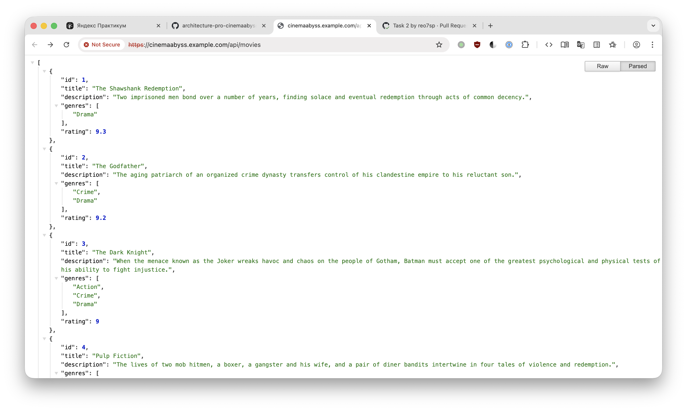

## Задание 4

Скриншоты:
- 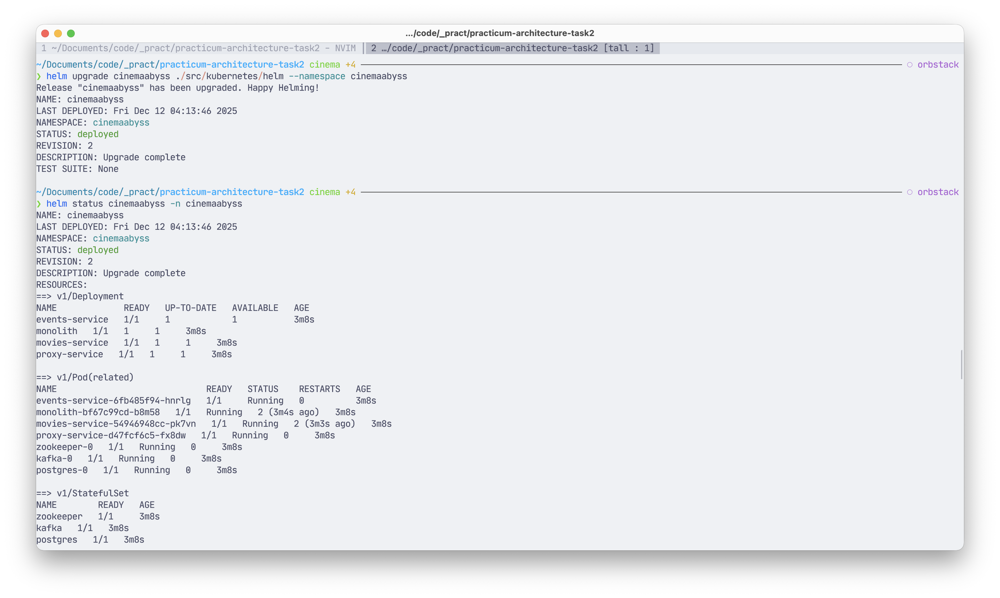
- 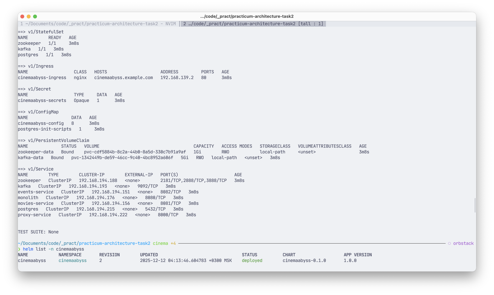
- 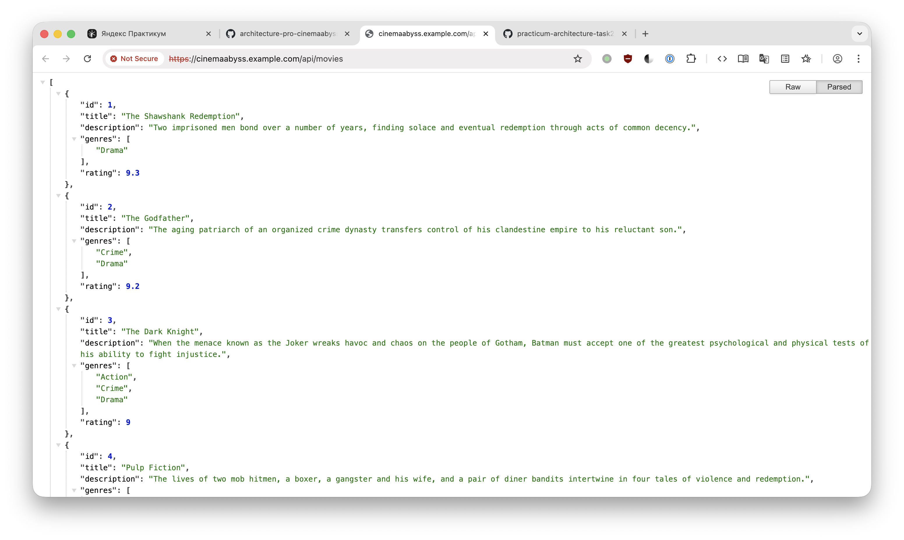

# Задание 5

Скриншоты:
- 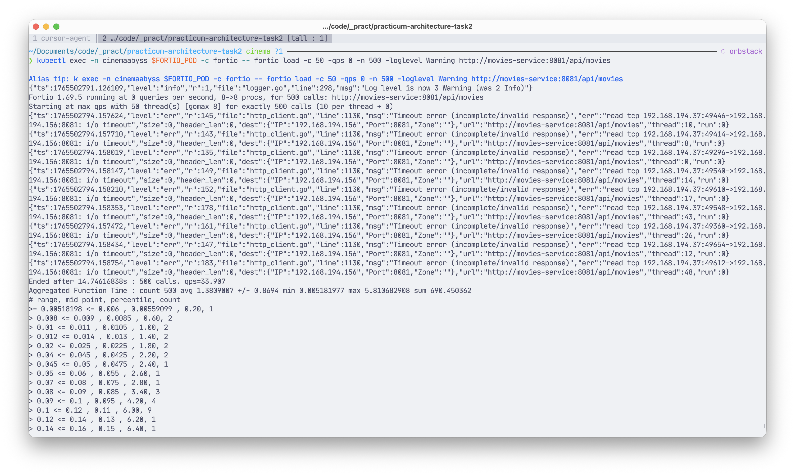
- 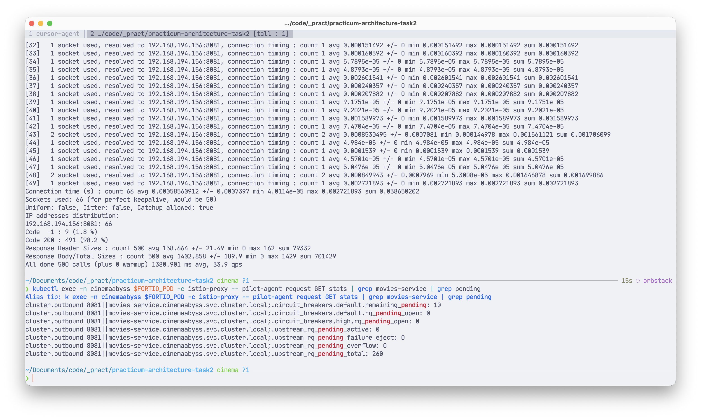
